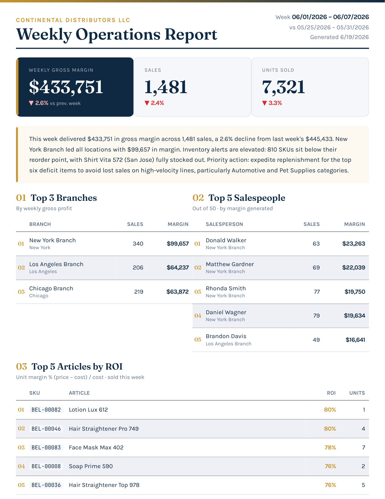
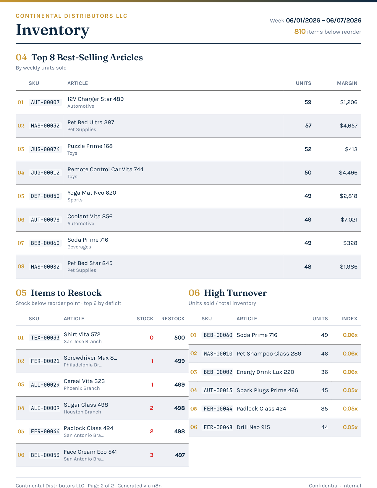
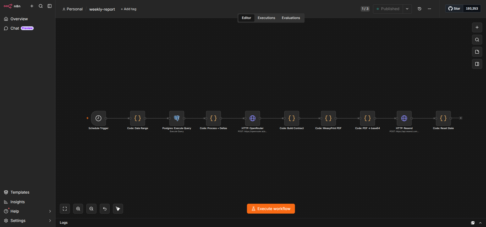
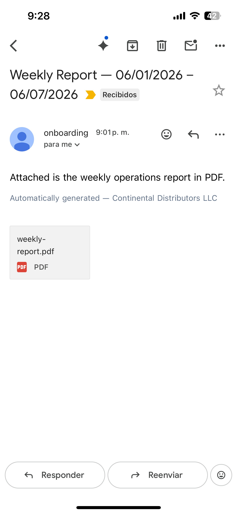
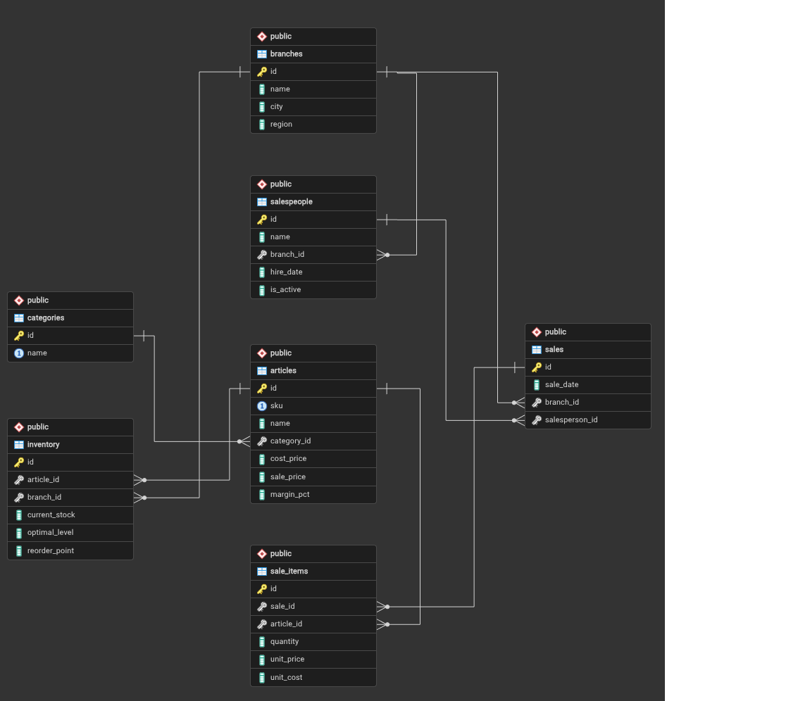

<h1 align="center">📊 Automated Sales & Inventory Reporting Pipeline</h1>

<em>A completed and validated architecture for automated operational reporting: database analytics, AI narrative generation, deterministic PDF rendering, and scheduled email delivery — fully self-hosted.</em>

  
  
  
  
  
  
  

---

  
  &nbsp;
  

## Table of Contents

1. [Overview](#1-overview)
   - [1.1 What it solves](#11-what-it-solves)
   - [1.2 Problem & context](#12-problem--context)
2. [Walkthrough](#2-walkthrough)
3. [Architecture](#3-architecture)
   - [3.1 Container view](#31-container-view)
   - [3.2 Weekly pipeline](#32-weekly-pipeline)
   - [3.3 Data layer](#33-data-layer)
   - [3.4 Orchestration layer](#34-orchestration-layer)
   - [3.5 Rendering & delivery](#35-rendering--delivery)
   - [3.6 Resilience](#36-resilience)
   - [3.7 Template design pipeline](#37-template-design-pipeline)
   - [3.8 Deployment topology](#38-deployment-topology)
   - [3.9 Quality attributes](#39-quality-attributes)
   - [3.10 PDF determinism](#310-pdf-determinism)
4. [Data model](#4-data-model)
   - [4.1 What each PDF section draws from](#41-what-each-pdf-section-draws-from)
   - [4.2 Analytics function](#42-analytics-function)
   - [4.3 Schema reference](#43-schema-reference)
5. [Key decisions](#5-key-decisions)
6. [Tech stack](#6-tech-stack)
7. [Validation & outcomes](#7-validation--outcomes)
   - [7.1 Test layers and what to cover](#71-test-layers-and-what-to-cover)
   - [7.2 End-to-end scope](#72-end-to-end-scope)
8. [Scope & status](#8-scope--status)
9. [Author](#9-author)

## 1. Overview

### 1.1 What it solves

- **Eliminates manual report assembly** — no data pulls, spreadsheet work, or triggered emails; the full cycle runs automatically every Monday at 7:00 AM.
- **Surfaces inventory risk early** — flags items below reorder threshold with recommended restock quantities and highlights high-turnover SKUs before they become stockouts.
- **Delivers consistent weekly KPI visibility** — gross margin, revenue, units sold, and top performers by branch, salesperson, and product, every week on the same schedule.
- **Generates the executive narrative automatically** — AI writes a two-paragraph plain-prose summary; no analyst required to interpret the numbers.
- **Guarantees layout correctness** — a page-count assertion blocks delivery of any truncated or overflowing report; the recipient always gets exactly two A4 pages or nothing.
- **Recovers from failures without human intervention** — stepped retries over ~140 minutes absorb transient outages before escalating to an administrator.

### 1.2 Problem & context

Distribution businesses with multiple branches, hundreds of SKUs, and a team of salespeople generate the data they need — but consolidating it, computing the right metrics, and delivering it before Monday's first decisions is a recurring manual task that regularly gets skipped.

**Cost of skipping:**

- Slow-moving inventory goes unnoticed until it becomes dead stock
- Underperforming branches are not addressed until the monthly review
- Stocking decisions are made from memory rather than fresh data

**This system replaces the manual process entirely.** Data consolidation, analytics, narrative writing, PDF rendering, and email delivery all run on a fixed schedule with no human trigger.

**Report content:**

- *Page 1:* four headline KPIs (gross margin, revenue, total sales, units sold) with week-over-week deltas · AI executive summary · top-performer rankings by branch, salesperson, and product
- *Page 2:* best-sellers by units moved · low-stock items with recommended reorder quantities · high-turnover index

**Design constraints:**

- Single server, Docker Compose — no cloud-managed infrastructure
- Only two outbound API calls: an LLM gateway (narrative) and an email service (delivery)
- Analytics independently testable without the orchestration layer running
- Pipeline auditable without code literacy
- Recipient gets a plain email with a PDF attachment — no new app or login required

> *Page 1 (left): headline KPIs with week-over-week deltas, AI executive summary, and top-performer rankings. Page 2 (right): best-sellers, low-stock items with reorder quantities, and high-turnover index.*

## 2. Walkthrough

The pipeline runs unattended every Monday at 7:00 AM. Below is the n8n workflow canvas showing the eight pipeline stages and the report as delivered to the recipient's inbox.

  

> *The weekly report pipeline on the n8n canvas: cron trigger → resolve week boundaries → database analytics query → week-over-week deltas → AI narrative → data contract assembly → PDF rendering with page-count assertion → email delivery. The companion error-handler workflow (not shown) runs independently with its own retry state.*

  

> *Report as received on iPhone: plain-text body with the AI-generated executive summary, PDF attachment, delivered via Resend on the scheduled Monday morning window.*

  <a href="public/report-example.pdf"><strong>View sample report PDF →</strong></a>

## 3. Architecture

A fully automated pipeline with no interactive components. A cron trigger fires every Monday at 7:00 AM US Eastern; the pipeline runs unattended and delivers the report to the business owner's inbox that same morning.

  

### 3.1 Container view

All services run on a single host inside an isolated Docker bridge network. Only two outbound HTTPS calls are made per successful run.

  

### 3.2 Weekly pipeline

Eight stages in a linear sequence. Each stage has exactly one responsibility.

  

### 3.3 Data layer

- **Two domains:** distribution operations (branches, salespeople, products, categories) and transaction history (sales + line items with point-of-sale prices, decoupled from the current catalogue)
- **Single analytics function:** accepts time-window boundaries, returns the full report as one JSON object — independently testable from any SQL client, no orchestrator needed
- **Read-only access:** the orchestration layer connects via a dedicated read-only role — physically cannot modify source data
- **Synthetic dataset:** 10 branches · 50 salespeople · 1,000 SKUs · 10,000 inventory records (~8% below reorder threshold) · ~80,000 sales · 168,000 line items · 12 months with weekday variation and seasonal patterns

### 3.4 Orchestration layer

- Linear 8-step workflow; zero business logic — the DB function is the single source of truth for all analytics
- A companion error workflow runs with independent state; retry counters cannot interfere with the next scheduled run
- **Why n8n over hand-written cron scripts:**
  - Visual canvas → auditable without code literacy
  - Built-in error routing and execution logging → no scaffolding to build
  - Workflow exports as version-controlled JSON

### 3.5 Rendering & delivery

Three sequential responsibilities:

1. **Contract assembly** — orchestrator normalizes all arrays to fixed lengths and caps the AI narrative to a character ceiling; all formatting decisions belong to the template
2. **Schema validation + rendering** — the WeasyPrint service validates the contract against a JSON Schema before touching the Jinja2 template; all display logic (monetary formatting, percentage deltas, text truncation) lives in the template; fonts are bundled in the container image for identical output on any host
3. **Page-count assertion** — rendering service returns the page count in a response header; orchestrator asserts exactly 2 pages; if the assertion fails, execution aborts and the error handler takes over

### 3.6 Resilience

Six retry attempts with stepped delays — ~140 minutes of automatic recovery before escalating to a human:

- Delays: 5 → 10 → 15 → 20 → 30 → 60 minutes
- Each attempt logs: timestamp · attempt number · failing stage · error message
- After six exhausted attempts: admin alert email sent, retry state cleared, next week starts clean

  

### 3.7 Template design pipeline

The report layout is fully customizable per client without touching the pipeline or the database. Four artifacts define a layout, each with one responsibility:

| Artifact | Role |
|----------|------|
| HTML design mock | Static page with hardcoded values — defines the visual target |
| Formal layout spec | Documents every field, data source, type, and fixed row count per table section |
| JSON data contract | Derived from the spec; validated on every render |
| Jinja2 template | Variables replace the hardcoded values from the mock |

A test fixture (complete valid payload) enables full rendering preview without a live database or credentials. To redesign for a new client: replace the HTML mock and the spec — the DB function and pipeline workflow stay unchanged.

  

### 3.8 Deployment topology

Full stack on a single server. Minimum specs: 1–2 vCPU · 2 GB RAM · 20 GB SSD — one scheduled job per week, completes in under 2 minutes.

- No inbound ports exposed beyond SSH
- n8n admin panel accessed via SSH tunnel only (not exposed to the internet)
- All inter-service traffic stays on the Docker bridge network

  

### 3.9 Quality attributes

| Attribute | How it is enforced |
|-----------|-------------------|
| Fault isolation | Error handler catches failures independently; retry state cannot leak into the next scheduled run |
| Auditability | Visual n8n canvas + structured log per retry event (stage, error message, timestamp) |
| Testability | All business logic in one DB function (callable from any SQL client); rendering testable with a static fixture, no live credentials needed |
| Layout determinism | Fixed array sizes + capped narrative + fixed-width table geometry + page-count assertion = correct 2-page report every time, or nothing |

### 3.10 PDF determinism

The report always produces exactly two A4 pages with a consistent layout — or it does not get delivered at all. This guarantee is not a single check but a layered set of controls applied at three stages: before rendering, during rendering, and after rendering.

**Input controls — before rendering**

The orchestrator enforces the shape and size of every value passed to the template before the renderer is ever invoked:

| Control | Mechanism | Effect |
|---------|-----------|--------|
| Contract structure | JSON Schema validation at the WeasyPrint service entry point | Malformed or missing fields are rejected before touching the template |
| Array lengths | Orchestrator normalizes every ranking and list to a fixed row count | Top-N tables always render the same number of rows regardless of how many records the DB returned |
| AI narrative length | Character ceiling enforced in the n8n code node before contract assembly | The narrative block never overflows its reserved area |

**Rendering controls — during rendering**

The template and its environment are designed so that no runtime variable can change the visual geometry:

| Control | Mechanism | Effect |
|---------|-----------|--------|
| Table column widths | Explicit pixel/percentage widths in print CSS, no `auto` | Columns do not reflow based on content length |
| Page dimensions | A4 size declared in `@page` CSS rule with fixed margins | The renderer cannot produce a different page size |
| Typography | Fonts bundled inside the WeasyPrint container image | No network fetch at render time; identical glyphs and metrics on every host and every run |
| Page breaks | Explicit `page-break-before` / `page-break-after` rules in CSS | Section boundaries are structural, not inferred from content flow |

**Output verification — after rendering**

The renderer returns the page count as a response header. The orchestrator reads it and asserts exactly `2` before proceeding to email delivery. If the assertion fails — due to any unexpected overflow, missing content, or renderer regression — the pipeline aborts and the error handler takes over. The recipient never receives a truncated or malformed report.

  

> *Two groups of controls (input normalization and rendering constraints) feed into a page-count assertion. Only a result of exactly 2 pages reaches the delivery step.*

## 4. Data model

The database is structured around two concerns, each feeding a distinct set of PDF sections:

- **Transaction history** — SALE and SALE_ITEM record every line-item sale with the price captured at the moment of sale, attributed to a BRANCH and SALESPERSON. This is the source for all revenue metrics, rankings, and best-seller calculations.
- **Inventory** — INVENTORY holds current stock levels and reorder thresholds per SKU per branch, independent of sales history. This is the sole source for low-stock alerts and the turnover index.

Line-item prices are stored on SALE_ITEM at point of sale and are decoupled from the current ARTICLE catalogue — historical revenue figures are never affected by price changes.

### 4.1 What each PDF section draws from

| PDF section | Source tables | What is computed |
|---|---|---|
| Headline KPIs | SALE, SALE_ITEM | Gross margin, revenue, total sales, units sold — aggregated over the current week |
| Week-over-week deltas | SALE, SALE_ITEM | Same aggregations over the previous week; percentage change computed in the orchestrator |
| Branch rankings | SALE, SALE_ITEM, BRANCH | Revenue and units per branch, ordered descending |
| Salesperson rankings | SALE, SALE_ITEM, SALESPERSON | Revenue per salesperson, ordered descending |
| Product rankings | SALE, SALE_ITEM, ARTICLE | Revenue per SKU, ordered descending |
| Best-sellers | SALE_ITEM, ARTICLE | Units moved per SKU over the current week |
| Low-stock alerts | INVENTORY, ARTICLE | SKUs where `current_stock < reorder_threshold`; reorder quantity = threshold − current stock |
| Turnover index | SALE_ITEM, INVENTORY, ARTICLE | Units sold relative to average stock level; flags high-velocity SKUs |

### 4.2 Analytics function

A single PostgreSQL function accepts two date parameters (current week start, previous week start) and returns the complete report payload as one JSON object. The orchestration layer makes exactly one read-only database call per run — there is no query logic in the pipeline itself.

This design means the entire analytics layer is independently testable from any SQL client without running n8n, and the orchestrator cannot drift out of sync with the data model.

  

> *Three source groups feed the analytics function in a single call. The function returns all six report sections as one JSON object.*

### 4.3 Schema reference

  

> *SALE and SALE_ITEM form the transaction spine. BRANCH, SALESPERSON, ARTICLE, and CATEGORY are the dimension tables. INVENTORY is independent of the transaction history and is joined only for stock-level calculations.*

## 5. Key decisions

| # | Decision | Chosen | Discarded | Rationale |
|---|----------|--------|-----------|-----------|
| 1 | Orchestration | n8n visual workflow | Hand-written cron scripts | Visual, auditable, and version-controlled; faster to adapt per client |
| 2 | Analytics location | Single database function | Logic spread across orchestrator nodes | Independently testable via SQL client; orchestrator stays a thin pipe |
| 3 | PDF generation | Self-hosted WeasyPrint | Cloud PDF API / Chromium-based renderer | Full typography control; ~100 MB RAM vs ~500 MB for Chromium |
| 4 | Layout stability | Typed data contract + page-count assertion | Free-form HTML passed to renderer | Output is deterministic; layout drift fails before email is sent — not after |
| 5 | Data access | Read-only database role | Full-access connection | The orchestration layer cannot modify source data by design |
| 6 | Font delivery | Bundled in container image | Runtime fetch from Google Fonts | Removes outbound network dependency at render time; output identical on any host |
| 7 | AI model selection | Configurable via environment variable | Model hardcoded in workflow | No vendor lock-in; model can be swapped without changing the workflow |
| 8 | Error strategy | Stepped backoff + admin escalation after 6 attempts | Single attempt / manual recovery | ~140 min unattended recovery window before a human is needed |
| 9 | Delivery channel | Email with PDF attachment | Web dashboard / messaging API | Lowest friction for the recipient; no new app or login required |
| 10 | Deployment | Self-hosted Docker Compose on a single host | Cloud-managed services | Full control; no platform lock-in; portable to any host |

## 6. Tech stack

| Layer | Technology | Why this over alternatives |
|-------|-----------|----------------------------|
| Orchestration | n8n 2.25.7 | Visual, auditable pipeline; built-in error routing and execution logging; workflow JSON is version-controlled |
| Persistence | PostgreSQL 18.4 | Relational integrity for transactional data; analytics function runs close to the data where joins across ~250k rows are efficient |
| Rendering | WeasyPrint 62.3 | Self-hosted HTML-to-PDF; full control over A4 print CSS and custom typography |
| Rendering service | Flask 3.1.0 + gunicorn | Stateless JSON microservice; validates the data contract against a JSON Schema before touching the template |
| AI narrative | OpenRouter API | Model-agnostic LLM gateway; swap models via environment variable without changing the workflow |
| Email delivery | Resend API | Transactional email with PDF attachment; free tier covers four reports per month |
| Synthetic data | Python 3.11 + Faker | Generates 12-month sales history with Pareto SKU distribution and sinusoidal seasonality; deterministic and reproducible |
| Runtime | Docker Compose — 3 services | Reproducible, portable deployment; entire stack deployable on a minimal single-host VPS |

## 7. Validation & outcomes

The test suite is structured as sequential layers, each independently verifiable. All layers passed against the live containerized stack. An end-to-end run completed successfully: the pipeline executed against the seeded database, the PDF rendered as exactly two A4 pages, and the report was delivered to the recipient inbox as an email attachment.

### 7.1 Test layers and what to cover

| Layer | What to test |
|-------|-------------|
| Workflow static analysis | Node structure and connections; cron expression correctness (`0 7 * * 1`); environment variable references present; retry counter state isolated from the main workflow so it cannot carry over into the next scheduled run |
| Infrastructure validation | Docker Compose parses cleanly; required environment variables declared; healthchecks defined for each service; volumes configured for persistence; ports not exposed beyond loopback |
| Schema tests | All expected tables and columns exist; indexes present on join and filter columns; read-only role has no INSERT/UPDATE/DELETE grants on any table |
| Analytics function | Return value matches the expected JSON structure; every array is bounded to the fixed length the orchestrator requires; week-over-week delta logic correct at week boundaries; low-stock detection triggers at the right threshold |
| Seed validation | SKU revenue follows a Pareto distribution (top ~20% of SKUs drive ~80% of revenue); daily volumes show weekday variation and sinusoidal seasonality over 12 months; percentage of inventory records below reorder threshold falls within the expected range |

### 7.2 End-to-end scope

**Validated:** full pipeline against the seeded database — analytics query, AI narrative, PDF rendering (exactly 2 A4 pages), and email delivery to the account owner inbox.

**Deliberately not validated:** production-domain delivery requires SPF/DKIM verification with the email provider. Sandbox delivery was confirmed. Tests gating production-domain delivery are skipped — pending for the production deployment step.

## 8. Scope & status

**This is a technical architecture reference.** The implementation is proprietary and not included in this repository.

**Scope:** single company · single recipient.

**Out of scope** (documented as future evolutions, not missing features):

- Multi-tenancy, per-branch individualized reports, graphical charts in the PDF
- Historical report storage across weeks, real-time stock-out alerts, web dashboard, predictive demand forecasting
- Security hardening specifics (TLS termination, reverse-proxy configuration, SSH key management)
- Observability infrastructure (external uptime monitoring, alerting dashboards) and operational runbooks

## 9. Author

**Miguel Ladines** · [@dev-mikel](https://github.com/dev-mikel)  
Electronics Engineer · AI Developer | Automation & Systems Integration

